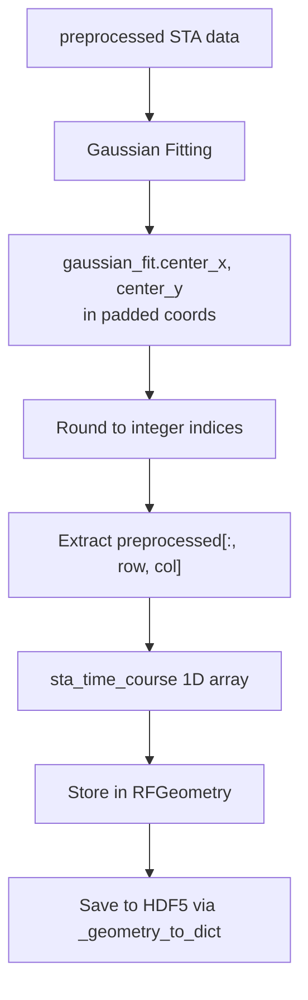

# Add STA Time Course Extraction

## Changes Required

### 1. Update `RFGeometry` dataclass in [rf_sta_measure.py](Projects/rf_sta_measure/rf_sta_measure.py)

Add a new field to store the time course:

```python
@dataclass
class RFGeometry:
    # ... existing fields ...
    sta_time_course: Optional[np.ndarray] = None  # Time course at center (1D array)
```

### 2. Update `extract_rf_geometry` function in [rf_sta_measure.py](Projects/rf_sta_measure/rf_sta_measure.py)

After the Gaussian fitting (around line 1065), add extraction of time course:

1. Use gaussian_fit center (before padding removal) - need to get the pre-adjusted values
2. Round the gaussian center to nearest integer for array indexing
3. Extract time course from `preprocessed[:, center_row_pad, center_col_pad]`
4. Include in the returned `RFGeometry` object

Key logic:

```python
# Extract time course at gaussian center (using padded coordinates)
sta_time_course = None
if gaussian_fit is not None:
    # Round gaussian center to nearest pixel (still in padded coords at this point)
    tc_row = int(round(gaussian_fit.center_y))  # center_y = row
    tc_col = int(round(gaussian_fit.center_x))  # center_x = col
    # Ensure within bounds
    tc_row = max(0, min(tc_row, preprocessed.shape[1] - 1))
    tc_col = max(0, min(tc_col, preprocessed.shape[2] - 1))
    sta_time_course = preprocessed[:, tc_row, tc_col].copy()
```

Note: This must be done BEFORE the `remove_padding_coords` call that adjusts gaussian_fit coordinates.

### 3. Update `_geometry_to_dict` in [rf_session.py](Projects/rf_sta_measure/rf_session.py)

Add the time course to the saved output:

```python
# Add sta_time_course if available
if geometry.sta_time_course is not None:
    result['sta_time_course'] = geometry.sta_time_course
```

## Data Flow



## Output Location