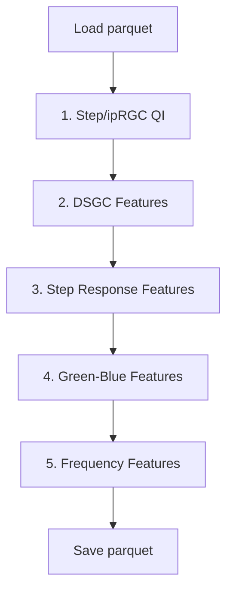

# Combined Feature Extraction Pipeline

## Overview

1. Modify two existing files to add `skip_filtering` parameter
2. Create a new unified pipeline file that imports and calls all high-level functions

## Pipeline Flow




## Step 1: Modify Existing Files

### [`extract_feature_step.py`](dataframe_phase/extract_feature/extract_feature_step.py)

Add `skip_filtering: bool = False` parameter to `extract_step_features()`. When `True`, skip the QC filtering block (lines 403-421).

### [`extract_feature_gb.py`](dataframe_phase/extract_feature/extract_feature_gb.py)

Add `skip_filtering: bool = False` parameter to `extract_gb_features()`. When `True`, skip the QC filtering block (lines 378-401).

## Step 2: Create Combined Pipeline

Create [`dataframe_phase/extract_feature/extract_all_features.py`](dataframe_phase/extract_feature/extract_all_features.py)

### Imports

```python
from extract_feature_step_iprgc import compute_step_up_qi, compute_iprgc_qi, add_good_cell_counts
from extract_feature_dsgc import remap_direction_columns, process_unit, DIRECTION_ANGLES, CORRECTED_DIRECTION_COLUMNS, N_PERMUTATIONS, N_TRIALS
from extract_feature_step import extract_step_features
from extract_feature_gb import extract_gb_features
from extract_feature_freq import extract_freq_step_features
```


### Processing Steps

1. **Step/ipRGC QI**: Call `compute_step_up_qi()`, `compute_iprgc_qi()`, `add_good_cell_counts()`
2. **DSGC**: Loop with `remap_direction_columns()` and `process_unit()` (same as original main)
3. **Step Response**: Call `extract_step_features(df, skip_filtering=True)`