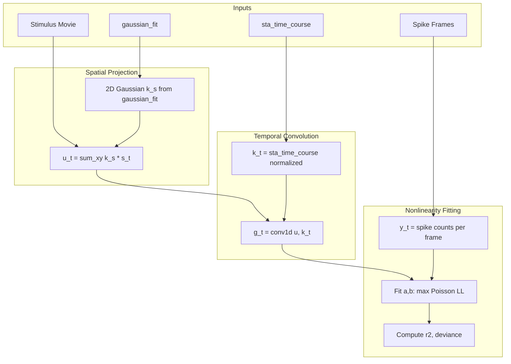

# Implement LNL Fitting in RF Geometry Extraction

## Overview

Add LNL (Linear-Nonlinear) model fitting to the existing RF geometry extraction workflow. The approach uses:

- **Spatial filter**: 2D Gaussian from `gaussian_fit` (center_x, center_y, sigma_x, sigma_y)
- **Temporal filter**: `sta_time_course` (already extracted at Gaussian center)
- **Nonlinearity**: Poisson LNP with $f(g) = \exp(b + a \cdot g)$

Results saved to: `features/sta_perfect_dense_noise_15x15_15hz_r42_3min/sta_geometry/lnl/`

## Data Flow




## Files to Modify

### 1. [rf_sta_measure.py](Projects/rf_sta_measure/rf_sta_measure.py)

Add new dataclass and fitting functions:

```python
@dataclass
class LNLFit:
    """Linear-Nonlinear model fit results."""
    a: float               # Gain parameter in f(g) = exp(b + a*g)
    b: float               # Baseline parameter
    log_likelihood: float  # Poisson log-likelihood
    null_log_likelihood: float  # LL of constant-rate model
    deviance_explained: float   # 1 - deviance/null_deviance
    r_squared: float       # Correlation between predicted and observed
    n_frames: int          # Number of frames used
    n_spikes: int          # Total spikes in fitting window
```

Add functions:

- `build_spatial_filter_from_gaussian(gaussian_fit, grid_size)` - creates normalized 2D Gaussian array
- `compute_generator_signal(movie_array, spatial_filter, temporal_filter, movie_start_frame)` - computes g_t via separable projection
- `fit_lnp_nonlinearity(generator_signal, spike_counts)` - fits a,b by maximizing Poisson LL using `scipy.optimize.minimize`
- `fit_lnl_model(...)` - main entry point combining the above

Add `lnl_fit: Optional[LNLFit] = None `field to `RFGeometry` dataclass.

### 2. [rf_session.py](Projects/rf_sta_measure/rf_session.py)

Modify `extract_rf_geometry_session` to:

- Accept optional `movie_array`, `spike_frames_dict`, `movie_start_frame` parameters
- After geometry extraction, call LNL fitting if stimulus data is available
- Store `lnl_fit` in `RFGeometry`

Update `_geometry_to_dict` to include LNL results:

```python
if geometry.lnl_fit is not None:
    result['lnl'] = {
        'a': lnl.a,
        'b': lnl.b,
        'log_likelihood': lnl.log_likelihood,
        ...
    }
```


### 3. [geometry.py](Projects/unified_pipeline/steps/geometry.py)

Modify `extract_rf_geometry_step` to:

- Load the stimulus movie (reuse `_load_stimulus_movie` from sta.py)
- Extract spike frames for each unit (reuse conversion logic from sta.py)
- Pass movie and spike data to `extract_rf_geometry_session`

This requires importing stimulus loading utilities:

```python
from hdmea.features.sta import (
    _load_stimulus_movie,
    _find_noise_movie_from_session,
)
```


## Output Structure

Per unit, saved under `units/{unit_id}/features/sta_perfect_dense_noise_15x15_15hz_r42_3min/sta_geometry/`:

```javascript
lnl/
├── a              (float) - gain parameter
├── b              (float) - baseline parameter  
├── log_likelihood (float) - Poisson log-likelihood
├── null_log_likelihood (float) - null model LL
├── deviance_explained (float) - goodness of fit
├── r_squared      (float) - correlation metric
├── n_frames       (int) - frames used
└── n_spikes       (int) - spikes used
```


## Key Implementation Details

1. **Spatial filter normalization**: The Gaussian is normalized to sum to 1 (or unit norm) so that generator signal has interpretable units.
2. **Temporal filter**: Use `sta_time_course` with sign determined by amplitude (ON vs OFF cell), normalized.
3. **Frame alignment**: The generator signal must be computed for frames where spikes can occur. Use the same `cover_range` logic as STA to handle edges.