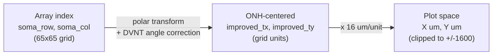

# Coordinate Transformation Summary

How raw electrode-array positions become the retinal spatial coordinates
used in the `figure_gb_control` hexbin heatmaps and quantification.

---

## 1. Three Coordinate Systems

| # | System | Units | Origin | Source |
|---|--------|-------|--------|--------|
| 1 | Array index | grid units (0-64) | top-left of 65x65 array | HDF5 `refined_soma/{x,y}` |
| 2 | ONH-centered retinal | grid units | optic nerve head (ONH) | `calculate_soma_polar_coordinates()` |
| 3 | Plot micrometers | um | ONH | `improved_tx * COORD_SCALE` |



---

## 2. Stage-by-Stage Detail

### Stage 1 -- Raw Extraction (compute_legacy_transformed.py)

**Inputs:** `labeled_dataframe.parquet` + HDF5 recording files.

Per unit, extracts from HDF5:

- `soma_row`, `soma_col` -- refined soma position on the 65x65 electrode grid
- `ap_slope`, `ap_intercept`, `ap_r_value` -- axon pathway linear fit
- `Center_xy` -- anatomical orientation string (e.g. `"L, 1.5, -0.8"`)

Per recording, computes:

- **Legacy ONH** via `calculate_optimal_intersection()` -- weighted mean of
  all pairwise pathway intersections
- **DVNT** via `parse_dvnt_from_center_xy()` (see Section 3)
- **Legacy transformed coordinates** via `calculate_soma_polar_coordinates()`
  (see Section 4)

**Output columns:** `legacy_transformed_x`, `legacy_transformed_y`

### Stage 3 -- Improved ONH (improve_onh_v6.py)

Replaces the ONH detection only; all other math is identical to legacy.

Robust ONH algorithm:

1. Keep pathways with $R^2 > 0.7$
2. Compute all pairwise intersections, discard if $|x - 33| > 80$ or $|y - 33| > 80$
3. Take median $(x, y)$ of surviving intersections
4. MAD outlier rejection ($3 \times \text{MAD}$), recompute median
5. Fall back to $R^2 > 0.5$ threshold if fewer than 2 valid pathways

Then calls the same `calculate_soma_polar_coordinates()` with the robust ONH.

**Output columns:** `improved_tx`, `improved_ty`

### Stage 4 -- Plotting (gb_spatial_control/spatial_plots.py)

Reads `improved_tx`, `improved_ty` from parquet. Applies:

$$x_{\mu m} = \text{improved\_tx} \times 16$$

$$y_{\mu m} = \text{improved\_ty} \times 16$$

Filters to $|x_{\mu m}| < 1600$ and $|y_{\mu m}| < 1600$, then generates
hexbin heatmaps with `gridsize=25` (all cells) or `gridsize=15` (per group).

---

## 3. DVNT Parsing (dvnt_parser.py)

The `Center_xy` metadata string records where on the retina the electrode
array was placed, in Yan Zhu's labeling convention.

**Format:** `"L/R, VD_coord, NT_coord"`

| Field | Raw convention | Converted field | Sign convention |
|-------|---------------|-----------------|-----------------|
| L/R | Left or Right eye | `lr_position` | string `"L"` or `"R"` |
| VD_coord | ventral-positive (Yan Zhu) | `dv_position = -VD_coord` | **positive = dorsal** |
| NT_coord | nasal-positive | `nt_position = NT_coord` | **positive = nasal** |

**Example:** `"L, 1.5, -0.8"` parses to:

- `lr_position = "L"`
- `dv_position = -1.5` (ventral side of retina)
- `nt_position = -0.8` (temporal side of retina)

---

## 4. Core Transform: calculate_soma_polar_coordinates()

**Source:** `src/hdmea/features/ap_tracking/pathway_analysis.py`, lines 1979-2055.

### 4.1 Displacement from ONH

```
soma_x, soma_y = soma_row, soma_col     # (row, col) unpacking
dx = soma_y - intersection.x            # column displacement
dy = soma_x - intersection.y            # row displacement
```

Here `intersection.x` is in column space and `intersection.y` is in row
space (matching the AP pathway fit convention where pathways are
$\text{col} = \text{slope} \times \text{row} + \text{intercept}$,
so the intersection is stored as $(x=\text{col}, y=\text{row})$).

### 4.2 Raw polar angle

$$r = \sqrt{dx^2 + dy^2}$$

$$\theta_{\text{raw}} = \text{atan2}(dy, dx) = \text{atan2}(\Delta\text{row}, \Delta\text{col})$$

### 4.3 DVNT angle correction

Computed by `_calculate_angle_correction()` (lines 1927-1976):

1. **Actual reference direction** -- angle from ONH to array center (33, 33):

$$\theta_{\text{ref}} = \text{atan2}(33 - \text{ONH}_{\text{row}},\; 33 - \text{ONH}_{\text{col}})$$

2. **Expected anatomical direction** -- from DVNT metadata:

$$\theta_{\text{expected}} = \text{atan2}(\text{dv\_position},\; \text{nt\_position})$$

3. **Correction:**

$$\Delta\theta = \theta_{\text{expected}} - \theta_{\text{ref}}$$

### 4.4 Final transformed coordinates

$$\theta_{\text{final}} = \theta_{\text{raw}} + \Delta\theta$$

$$\text{transformed\_x} = r \cos(\theta_{\text{final}})$$

$$\text{transformed\_y} = r \sin(\theta_{\text{final}})$$

The angle correction rotates all cells from one recording by the same
amount, aligning the array-relative positions into a common anatomical
frame.

---

## 5. Final Axis Orientation (D/V/N/T)

After transformation and scaling, the axes represent:

```
                    Dorsal (+Y)
                        |
                        |
  Temporal (-X) --------+-------- Nasal (+X)
                        |
                        |
                    Ventral (-Y)
```

| Axis | Negative | Positive |
|------|----------|----------|
| X | Temporal (T) | Nasal (N) |
| Y | Ventral (V) | Dorsal (D) |

**Polar angle mapping** (used in gradient direction and polar plots):

| Angle | Direction |
|-------|-----------|
| 0 deg | Nasal (+X) |
| 90 deg | Dorsal (+Y) |
| +/-180 deg | Temporal (-X) |
| -90 deg | Ventral (-Y) |

**Quadrant assignment** (from `spatial_quantification_full.py`):

| Condition | Label | Anatomical meaning |
|-----------|-------|--------------------|
| x >= 0, y >= 0 | DN | Dorsal-Nasal |
| x < 0, y >= 0 | DT | Dorsal-Temporal |
| x >= 0, y < 0 | VN | Ventral-Nasal |
| x < 0, y < 0 | VT | Ventral-Temporal |

**Direction bins** (8 sectors from gradient angle):

| Angle range | Label |
|-------------|-------|
| -22 to +22 | Nasal |
| +22 to +68 | Dorsal-Nasal |
| +68 to +112 | Dorsal |
| +112 to +158 | Dorsal-Temporal |
| +/-158 to +/-180 | Temporal |
| -158 to -112 | Ventral-Temporal |
| -112 to -68 | Ventral |
| -68 to -22 | Ventral-Nasal |

All plot axis labels are consistent with this convention:
- `"T <-- X (um) --> N"` on X axis
- `"V <-- Y (um) --> D"` on Y axis

---

## 6. Correctness Analysis

### 6.1 Row-as-Y convention (CORRECT, self-consistent)

The formula `atan2(row_displacement, col_displacement)` treats increasing
row as the "y" component. In image/array coordinates, rows increase
downward, so this implicitly flips the vertical axis compared to standard
image display. However, this is **not a bug**: the angle correction
compensates by mapping the raw angle into the anatomical frame using
the DVNT metadata. The pipeline is self-consistent because:

- The reference angle `theta_ref` uses the same `atan2(row_disp, col_disp)`
  convention
- The expected angle `theta_expected` provides the target anatomical
  direction
- The difference `Delta_theta` correctly rotates from array-relative
  to anatomy-relative coordinates regardless of the row/column sign
  convention, as long as both `theta_ref` and `theta_raw` use the
  same convention (they do)

### 6.2 180-degree ambiguity (investigated, not applied)

`improve_onh_v5.py` diagnosed a potential 180-degree systematic error in
the legacy angle correction and proposed replacing
$\text{atan2}(\text{dv}, \text{nt})$ with
$\text{atan2}(-\text{dv}, -\text{nt})$.

The final pipeline (`v6`) did **not** adopt this fix. Justification:

- The angle correction is a per-recording rigid rotation; a global
  180-degree offset would flip all recordings consistently. If
  present, this would invert the D-V and N-T axes simultaneously.
- The observed positive correlation of `green_blue_on_ratio` with the
  Y axis (dorsal direction) is consistent with known retinal biology
  (cone opsin gradients), validating the current sign.
- v6 achieves stronger correlation ($r \approx 0.17$, $p < 10^{-100}$,
  $n > 15000$) than the v5 approach on the same data.

**Conclusion:** The current formula produces the correct orientation.
If the 180-degree flip were applied, the biological gradient would
anti-correlate with Y, contradicting known anatomy.

### 6.3 L/R eye handling (NOT implemented -- potential concern)

`lr_position` is parsed from `Center_xy` but is **never used** in any
coordinate transformation. For a left eye vs right eye, the nasal and
temporal sides are mirror-reflected. In principle, nasal-temporal (X axis)
should be flipped for one eye convention. This is not done.

**Impact:** If the dataset contains a mix of left and right eyes with
different nasal-temporal relationships, the X-axis gradient may be
diluted. The Y-axis (dorsal-ventral) gradient is unaffected by L/R
because dorsal and ventral do not swap between eyes.

**Mitigation:** The `green_blue_on_ratio` gradient runs primarily along
Y (dorsal-ventral), so L/R mixing has minimal effect on the main
biological signal. Features with strong nasal-temporal gradients
(X axis) should be interpreted with caution.

### 6.4 Axis label consistency (CORRECT)

All downstream scripts use the same convention:

| Script | X label | Y label |
|--------|---------|---------|
| `_dot_plot.py` | `Temporal <-- X (um) --> Nasal` | `Ventral <-- Y (um) --> Dorsal` |
| `_plot_gb_on.py` | `T <-- X (um) --> N` | `V <-- Y (um) --> D` |
| `spatial_plots_improved_v2.py` | `T <-- X (um) --> N` | `V <-- Y (um) --> D` |
| `visualize_radial_centers.py` | `X (um) T <-- --> N` | `Y (um) V <-- --> D` |
| `visualize_spatial_quant.py` | `X (um) T<-->N` | `Y (um) V<-->D` |
| `spatial_quantification_full.md` | `Temporal (neg) --> Nasal (pos)` | `Ventral (neg) --> Dorsal (pos)` |

Quadrant and direction-bin labels also match the axis convention (see
Section 5).

### 6.5 No post-hoc rotation in v6 (by design)

Earlier iterations experimented with additional corrections:

| Version | Extra correction | Status |
|---------|-----------------|--------|
| v2 | Search DVNT +/- 60 deg and DVNT + 180 +/- 60 deg | Superseded |
| v3 | Global rotation sweep (-180 to +180) | Superseded |
| v4 | `apply_global_rotation()` maximizing r(gb, Y) | Superseded |
| v5 | Negate DVNT direction + per-recording +/- 20 deg fine-tune | Superseded |
| **v6** | **ONH detection only; angle correction identical to legacy** | **Final** |

v6 achieved the best results by improving only the ONH localization
(robust median + MAD), without modifying the angle correction formula.
This is the cleanest approach because it avoids data-driven rotation
that could overfit to the `green_blue_on_ratio` gradient.

---

## 7. Source File Reference

| File | Role |
|------|------|
| `src/hdmea/features/ap_tracking/pathway_analysis.py` | `calculate_soma_polar_coordinates()`, `_calculate_angle_correction()`, ONH intersection |
| `src/hdmea/features/ap_tracking/dvnt_parser.py` | `parse_dvnt_from_center_xy()`, `DVNTPosition` dataclass |
| `dataframe_phase/spatial_distribution/notebooks/compute_legacy_transformed.py` | Stage 1: H5 extraction, legacy coords |
| `dataframe_phase/spatial_distribution/improved_legacy/improve_onh_v6.py` | Stage 3: robust ONH, `improved_tx/ty` |
| `dataframe_compare/gb_spatial_control/config.py` | `COORD_SCALE=16`, `COORD_LIMIT=100`, column names |
| `dataframe_compare/gb_spatial_control/prepare_data.py` | Data loading, NaN/range filtering |
| `dataframe_compare/gb_spatial_control/spatial_plots.py` | Hexbin heatmaps for `figure_gb_control` |
| `dataframe_compare/gb_spatial_control/spatial_quantification.py` | Gradient, Moran's I, radial, quadrant stats |
| `dataframe_compare/gb_spatial_control/spatial_radial_center.py` | Optimal radial center search |
