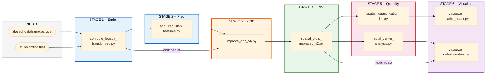
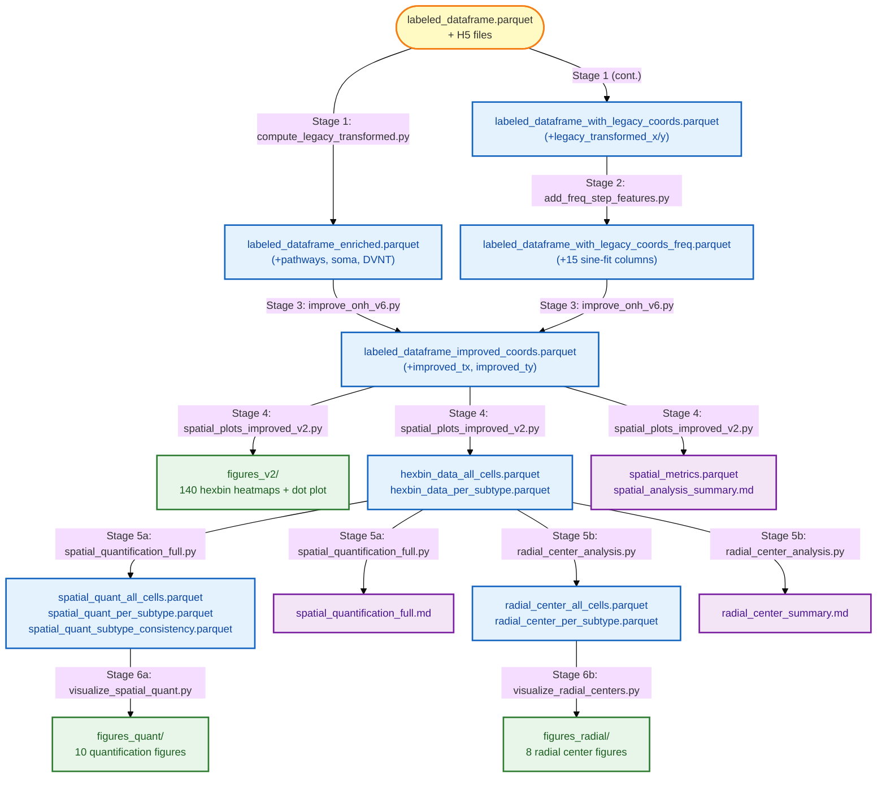

# Spatial Distribution Analysis -- Improved Pipeline Workflow

## Pipeline Overview

Six stages transform the classified cell dataframe into spatial quantification results and figures, using the improved (robust) ONH detection method.

```
Inputs --> Enrich --> Freq Features --> Robust ONH --> Plots + Hexbin --> Quantify --> Visualise
```

---

## Diagram 1: Script Execution Flow



---

## Diagram 2: Data Flow (what each stage produces)



---

## Stage Details

### Stage 1: Data Enrichment

**Script:** `notebooks/compute_legacy_transformed.py`

| Input | Output |
|-------|--------|
| `labeled_dataframe.parquet` (from classification) | `results/labeled_dataframe_enriched.parquet` |
| H5 files (`export_dsgc_sta_updated/*.h5`) | `results/labeled_dataframe_with_legacy_coords.parquet` |

- Reads AP tracking pathways (slope, intercept, $R^2$) and soma positions from H5
- Parses DVNT anatomical orientation from `Center_xy` metadata
- Computes legacy ONH via `calculate_optimal_intersection()` (weighted pairwise intersection)
- Transforms soma to retinal coordinates via `calculate_soma_polar_coordinates()` with DVNT-anchored angle correction at fixed reference (33, 33)
- Adds `legacy_transformed_x`, `legacy_transformed_y`

### Stage 2: Frequency-Step Features

**Script:** `notebooks/add_freq_step_features.py`

| Input | Output |
|-------|--------|
| `labeled_dataframe_with_legacy_coords.parquet` | `labeled_dataframe_with_legacy_coords_freq.parquet` |

- Averages 3 repetitions of `freq_step_5st_3x` traces
- Segments into 5 frequency bands (0.5, 1, 2, 4, 10 Hz)
- Fits $A \sin(2\pi f t + \phi) + C$ to each segment
- Adds 15 columns: `freq_sinefit_{f}hz_{amplitude, phase_deg, r_squared}`

### Stage 3: Improved ONH Detection

**Script:** `improved_legacy/improve_onh_v6.py`

| Input | Output |
|-------|--------|
| `labeled_dataframe_enriched.parquet` | `improved_legacy/labeled_dataframe_improved_coords.parquet` |
| `labeled_dataframe_with_legacy_coords_freq.parquet` | |

- Replaces legacy ONH with **robust ONH**: median of pairwise intersections, MAD outlier rejection, $R^2 > 0.7$ pathway filter
- Falls back to legacy ONH if < 3 valid pathways
- Same angle correction and coordinate transform as legacy (no flipping/rotation)
- Adds `improved_tx`, `improved_ty`
- Increases valid cells: 10,662 (legacy) to 15,645 (robust)

**v6 is the final version.** Earlier iterations: v1 diagnosed 180-deg ambiguity; v2 wider search; v3-v4 global rotation; v5 DVNT sign fix.

### Stage 4: Spatial Plots & Hexbin Export

**Script:** `improved_legacy/spatial_plots_improved_v2.py`

| Input | Output |
|-------|--------|
| `labeled_dataframe_improved_coords.parquet` | `improved_legacy/figures_v2/` (140 PNGs) |
| | `improved_legacy/results/hexbin_data_all_cells.parquet` |
| | `improved_legacy/results/hexbin_data_per_subtype.parquet` |
| | `improved_legacy/results/spatial_metrics.parquet` |
| | `improved_legacy/results/spatial_analysis_summary.md` |

- Dot plot of all 15,645 cells
- 70 all-cells hexbin heatmaps (Raw + GAM), color = mean +/- 50% of |mean|
- 70 per-subtype hexbin heatmaps (30 subtypes, **individual color scale** per subplot)
- Saves hexbin bin centers, raw means, GAM predictions, counts as parquet

### Stage 5a: Comprehensive Spatial Quantification

**Script:** `improved_legacy/spatial_quantification_full.py`

| Input | Output |
|-------|--------|
| `hexbin_data_all_cells.parquet` | `spatial_quant_all_cells.parquet` (70 x 51 cols) |
| `hexbin_data_per_subtype.parquet` | `spatial_quant_per_subtype.parquet` (2100 x 51 cols) |
| | `spatial_quant_subtype_consistency.parquet` (70 x 11 cols) |
| | `spatial_quantification_full.md` |

Eight metric categories computed per feature:

| # | Category | Key metrics |
|---|----------|-------------|
| 1 | Global gradient | WLS plane fit: $\beta_x$, $\beta_y$, magnitude, direction, $R^2$ |
| 2 | GAM structure | Deviance explained, delta vs plane, dynamic range, extremum location, hotspot area |
| 3 | Spatial autocorrelation | Global Moran's I, local Moran's $I_i$, Getis-Ord $G_i^*$ |
| 4 | Unevenness | Hexbin CV, Gini coefficient |
| 5 | Radial / angular | Radial $r$ + 999-bootstrap CI, quadrant means + ANOVA |
| 6 | Subtype consistency | Circular mean direction, circular SD, vector strength |
| 7 | Significance | 999-permutation nulls, Benjamini-Hochberg FDR |
| 8 | Phase handling | Circular mean/variance, cos/sin decomposition |

### Stage 5b: Radial Center Search

**Script:** `improved_legacy/radial_center_analysis.py`

| Input | Output |
|-------|--------|
| `hexbin_data_all_cells.parquet` | `radial_center_all_cells.parquet` (140 rows) |
| `hexbin_data_per_subtype.parquet` | `radial_center_per_subtype.parquet` (2100 rows) |
| | `radial_center_summary.md` |

- Searches for 2-D center that maximises $|r|$ between radial distance and bin value
- Coarse grid (+/-1200 um) -> fine grid (+/-300 um) -> Nelder-Mead (bounded +/-1800 um)
- Reports optimal center, $r$, $p$, slope, improvement over origin

### Stage 6a: Quantification Figures

**Script:** `improved_legacy/visualize_spatial_quant.py`

| Input | Output |
|-------|--------|
| `spatial_quant_*.parquet` (3 files) | `figures_quant/` (10 PNGs) |
| | Appends overall summary to `spatial_quantification_full.md` |

| Figure | Content |
|--------|---------|
| fig1_gradient_polar | Gradient direction and strength (polar plot) |
| fig2_plane_vs_gam | Plane $R^2$ vs GAM $R^2$ (nonlinear improvement) |
| fig3_moran_vs_gradient | Moran's I vs Plane $R^2$ (clustering vs trend) |
| fig4_radial_forest | Radial trends with 95% bootstrap CIs |
| fig5_quadrant_heatmap | Z-scored quadrant means |
| fig6_subtype_consistency | Vector strength + mean direction polar |
| fig7_significance_heatmap | $-\log_{10}$(FDR q) across 4 tests |
| fig8_multimetric_overview | Bubble chart (gradient x clustering x GAM x radial) |
| fig9_gam_hotspot_map | GAM extremum locations |
| fig10_summary_dashboard | 8-panel summary |

### Stage 6b: Radial Center Figures

**Script:** `improved_legacy/visualize_radial_centers.py`

| Input | Output |
|-------|--------|
| `radial_center_*.parquet`, `hexbin_data_all_cells.parquet` | `figures_radial/` (8 PNGs) |

| Figure | Content |
|--------|---------|
| radial_center_map_raw | Optimal centers (raw hexbin) by category |
| radial_center_map_gam | Optimal centers (GAM) by category |
| improvement_bar_chart | Origin vs optimal $|r|$ comparison |
| radial_profiles_top | Feature value vs radius for top features |
| feature_group_clustering | Centers by category with 1-SD ellipses |
| radial_direction_map | Center-high vs periphery-high |
| per_subtype_centers | Per-subtype centers for key features |
| radial_dashboard | 6-panel summary |

---

## File Tree (improved pipeline only)

```
improved_legacy/
|-- improve_onh_v6.py                        Stage 3
|-- spatial_plots_improved_v2.py             Stage 4
|-- spatial_quantification_full.py           Stage 5a
|-- radial_center_analysis.py                Stage 5b
|-- visualize_spatial_quant.py               Stage 6a
|-- visualize_radial_centers.py              Stage 6b
|
|-- labeled_dataframe_improved_coords.parquet
|
|-- results/
|   |-- hexbin_data_all_cells.parquet
|   |-- hexbin_data_per_subtype.parquet
|   |-- spatial_metrics.parquet
|   |-- spatial_quant_all_cells.parquet
|   |-- spatial_quant_per_subtype.parquet
|   |-- spatial_quant_subtype_consistency.parquet
|   |-- radial_center_all_cells.parquet
|   |-- radial_center_per_subtype.parquet
|   |-- spatial_analysis_summary.md
|   |-- spatial_quantification_full.md
|   +-- radial_center_summary.md
|
|-- figures_v2/
|   |-- dot_plot_all_cells.png
|   |-- all_cells/Hexbin_*.png               (70 files)
|   +-- per_subtype/Hexbin_*_subtypes.png    (70 files)
|
|-- figures_quant/
|   +-- fig1 ... fig10.png                   (10 files)
|
+-- figures_radial/
    +-- *.png                                (8 files)
```

Upstream scripts (Stages 1-2) live in `notebooks/`:

```
notebooks/
|-- compute_legacy_transformed.py            Stage 1
+-- add_freq_step_features.py                Stage 2

results/
|-- labeled_dataframe_enriched.parquet
|-- labeled_dataframe_with_legacy_coords.parquet
+-- labeled_dataframe_with_legacy_coords_freq.parquet
```
